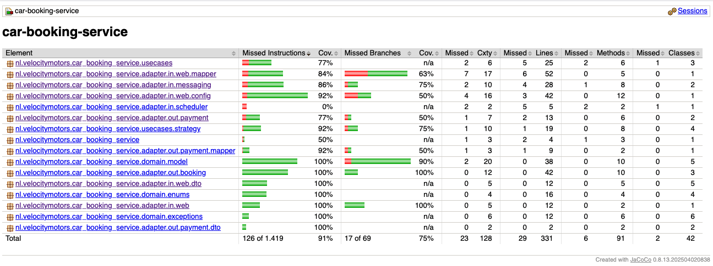
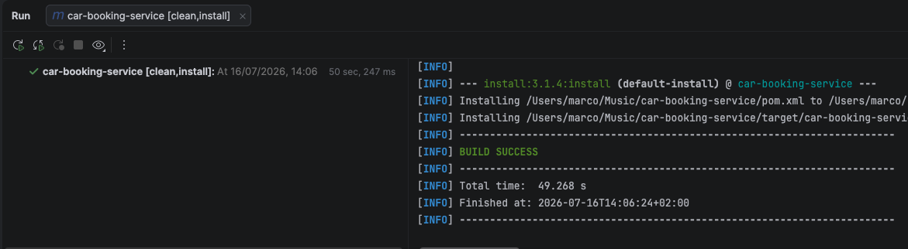
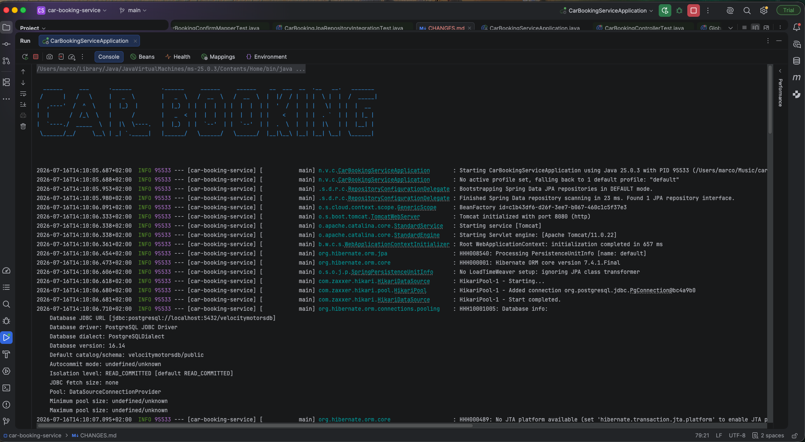
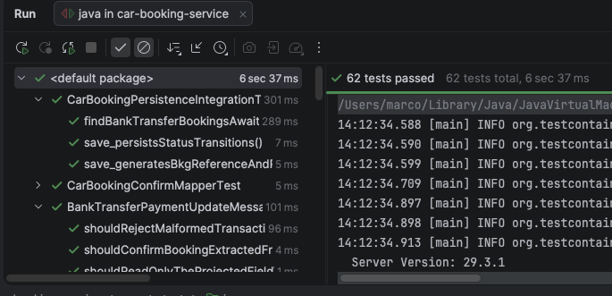

# Car Booking Service - Changes & Improvements

This document summarizes the changes made to the assignment during the improvement round.

---

## Bug fixes

- Bug with the logic to verify if the booking has more than 21 days
  - The rule used ChronoUnit, which truncates the hours, allowing invalid bookings, now it is using the "Duration.between(...)" API.
  - Commit: [fix: shouldn't allow a booking with 21 days and 1 second](https://github.com/marcoagpegoraro/car-booking-service/commit/491f7732327445b4f8de2908741b1fbad38437d3)

---

## Improvements

- Kafka configuration using the Spring Boot properties
  - Removed the custom KafkaConfig, the @Value fields and the @EnableKafka annotation, now the consumer is auto configured from the "spring.kafka.*" properties.
  - Commit: [feat: Replaced KafkaConfig with spring.kafka properties](https://github.com/marcoagpegoraro/car-booking-service/commit/a7d77e0c3eeb9d7d514eb27f52739b0254857868)

- Read only the needed field from the Avro message
  - The consumer now projects only the "transactionDetails" field (Avro schema projection with reader/writer schema resolution) instead of deserializing the whole event.
  - Commits: [feat: only retrieve one field from the kakfa avro message using GenericDatumReader](https://github.com/marcoagpegoraro/car-booking-service/commit/28e932ac378f814f00d029689b124b8f37f3c39d) and [feat: Removed the now unused deserialize method in the AvroMessageContainer](https://github.com/marcoagpegoraro/car-booking-service/commit/eac55bcc49497c059f70c6321f1e2bdafe6ee4a0)

- Explicit HTTP method on the payment client
  - The Feign client now uses @PostMapping instead of @RequestMapping without a method, so the contract is explicit.
  - Commit: [test: WireMock added to the project to test the payment api](https://github.com/marcoagpegoraro/car-booking-service/commit/99185bb6c158c9af46b67863b9a0636a2595c557)

- JaCoCo report on every build
  - Added the jacoco plugin so each "mvn test" generates an HTML coverage report.
  - Commit: [feat: jacoco plugin so it can generate the unit test code coverage](https://github.com/marcoagpegoraro/car-booking-service/commit/61135b8d7bfa9e4df1caa15ef0017957379470d7)

---

## Tests

- Tests for the web layer (controller, exception handler, mapper and request validation)
  - CarBookingControllerTest uses @WebMvcTest and MockMvc to cover the happy path, the validation error, the invalid enum value, the idempotency key and the error mapping.
  - GlobalExceptionHandlerTest checks that each exception maps to the correct HTTP status.
  - CarBookingConfirmMapperTest uses parametrized tests to cover every vehicle category and every payment mode enum.
  - CarBookingConfirmRequestValidationTest checks the bean validation constraints on the request.
  - Commit: [feat: Create tests for the web layer of the application.](https://github.com/marcoagpegoraro/car-booking-service/commit/9417e5a67b45195d1c4b341f2fdf19f7ba5c9884)

- Integration test for the database using Testcontainers
  - CarBookingPersistenceIntegrationTest runs against a real Postgres container and checks the BKG id generation, the entity mapping and the cancellation query.
  - CarBookingJpaRepositoryIntegrationTest checks the generated repository query "findByPaymentModeAndBookingStatusAndRentalStartDateLessThanEqual" directly, verifying it returns only the matching rows including the inclusive date boundary.
  - Commits: [feat: Test containers to test the postgres database](https://github.com/marcoagpegoraro/car-booking-service/commit/c908565216b2db538214cfaa1e81ce2c9628ef11) and [test: testing also the custom jpa method to find by payment mode and booking status](https://github.com/marcoagpegoraro/car-booking-service/commit/4997c860aad315c7924461f48e8fc89ce6e42874)

- Integration test for Kafka using EmbeddedKafka
  - BankTransferPaymentConsumerIntegrationTest publishes a real Avro event and checks that the consumer confirms the booking, plus a case for an invalid payload and a case for a duplicated message.
  - Commit: [test: Kafka integration tests, valid event, invalid event and duplicated event](https://github.com/marcoagpegoraro/car-booking-service/commit/8ba3983d1b75457d5d8bbe3af1c8052cd12e8004)

- Integration test for the payment integration using WireMock
  - PaymentServiceWireMockIntegrationTest stubs the payment API and checks the approved, the rejected and the server error case (circuit breaker fallback).
  - Commit: [test: WireMock added to the project to test the payment api](https://github.com/marcoagpegoraro/car-booking-service/commit/99185bb6c158c9af46b67863b9a0636a2595c557)

- ArgumentCaptor test for the confirm use case
  - ConfirmCarBookingUseCaseTest captures the booking sent to persistence and checks that the status computed by the payment rule is the one that gets saved.
  - Commit: [feat: Confirm car booking usecase with argument captor tests](https://github.com/marcoagpegoraro/car-booking-service/commit/99b7ac3b34027515437bacb9fc72fceffa29caed)

- Edge case tests for the rental period
  - RentalPeriodTest now covers exactly 21 days, 21 days plus one hour and 21 days plus one second.
  - Commit: [fix: shouldn't allow a booking with 21 days and 1 second](https://github.com/marcoagpegoraro/car-booking-service/commit/491f7732327445b4f8de2908741b1fbad38437d3)

---

## Code coverage

- The JaCoCo report is generated on every build at target/site/jacoco/index.html
- Current coverage is around 91% for instructions and 75% for branches

JaCoCo coverage:

---

## Screenshots

Running `mvn clean install`:

Application running:

All the 62 tests passing:
