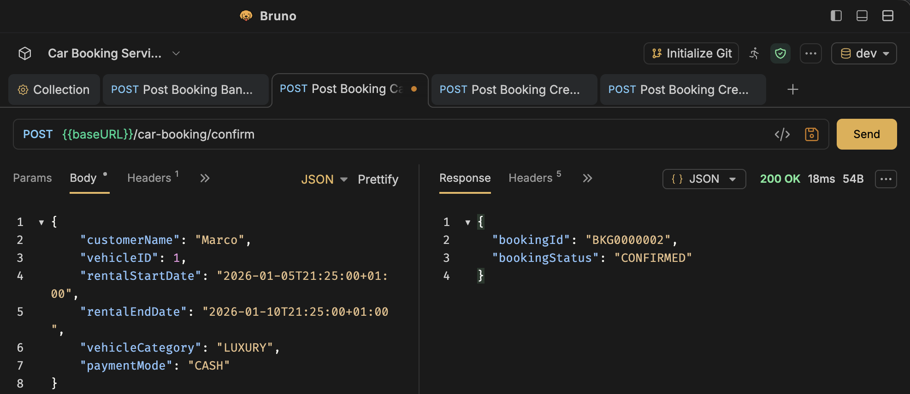
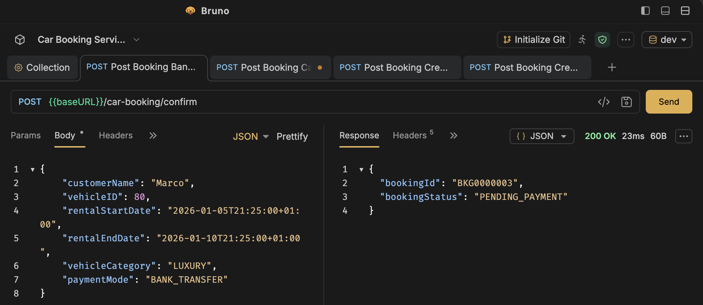
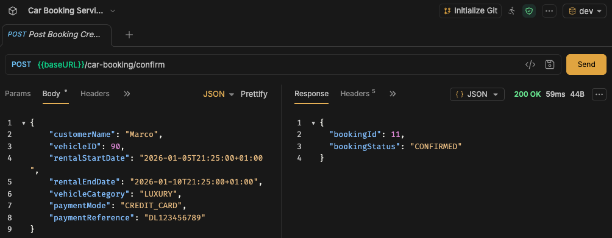
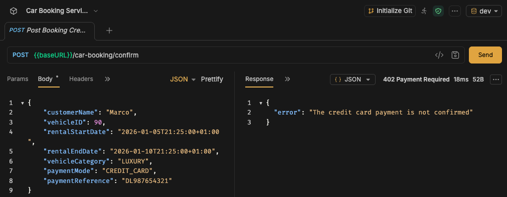
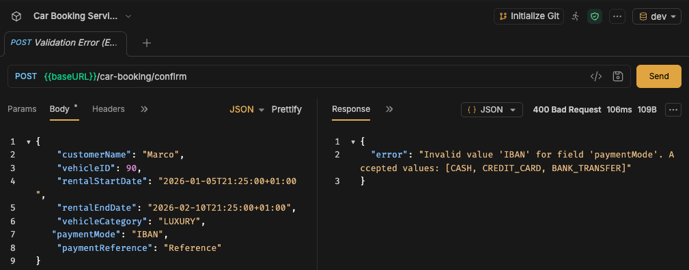
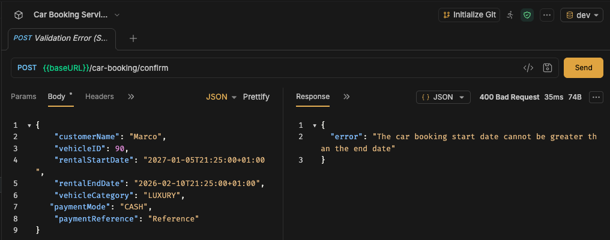
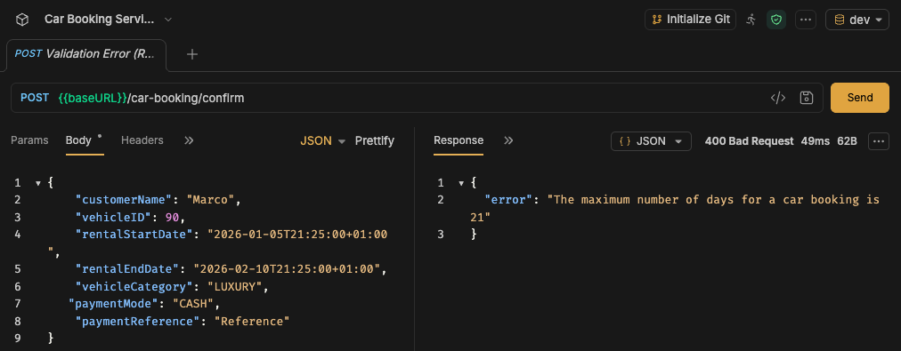
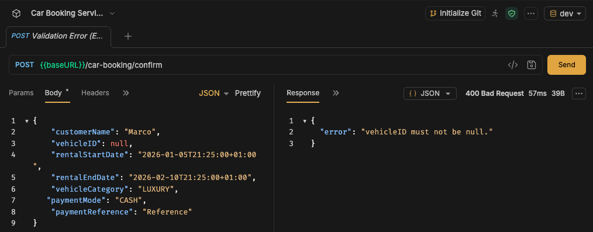
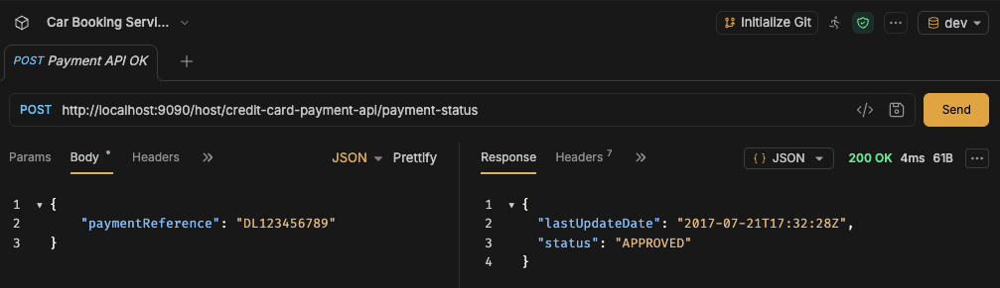
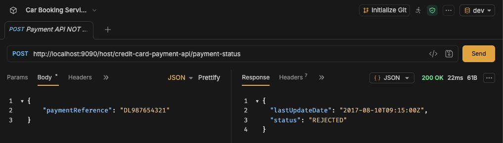

# Car Booking Service

This is a microservice that is responsible for processing the requests to confirm the booking of a rental car.

It has three input adapters:
- HTTP endpoint responsible for confirming a car booking.
- Kafka consumer that consumes the bank-transfer payment-completed events and confirms the booking accordingly.
- Scheduler that runs daily to cancel any bank-transfer booking whose payment was not received at least 48 hours before the rental start date.

## Architecture

It was built using the hexagonal architecture pattern together with DDD. Each layer has a well defined responsibility, so domain leaking does not occur.

These are the main packages of the application:

- adapter
  - Responsible for the inputs of the application (HTTP, Scheduler and Kafka) and its outputs (database via JPA and the credit-card payment service via HTTP).
- domain
  - The heart of the application, free of framework/infrastructure concerns.
  - We have here the `Booking` aggregate: it contains all the logic to create a valid booking and to transition its status (`confirmPayment()` / `cancel()`) using plain Java, protecting its own invariants.
  - We also have the value object `RentalPeriod`, which holds the validation required in the assignment regarding the start and end dates (end after start, and a maximum of 21 days).
  - It also contains the enums and the domain exceptions.
- port
  - Package that contains all the contracts (interfaces) that bind the application layer together with the infrastructure layer.
- usecases
  - The business logic orchestration of the microservice; each use case has a long and explicit name explaining what it does.

## Technologies

- Java 25
- Spring Boot 4.0.1
- Postgres 16
- Kafka and Zookeeper
- Apache Avro
- Docker Compose for all the other services that the app needs to run
- OpenFeign for HTTP requests
- Spring Scheduling for the bank-transfer auto-cancellation
- Node.js for the developer tooling under `dev/` (the payment mock and the Kafka Avro sender)

## Running the application

You will need Docker, a JDK 25 and Node.js installed on your machine.

First, start the dependencies (database, mocked payment service and Kafka/Zookeeper) with:

```
docker compose up -d
```

> Note: the `car-booking-service` itself is **not** part of Docker Compose — Compose only starts the dependencies above.

Then start the microservice from the project root:

```
./mvnw spring-boot:run
```

All configuration properties have sensible local defaults (see `application.properties`), so no environment variables are required to run it locally.

The `dev/` folder holds the developer tooling that isn't part of the service itself:
- `dev/payment-service` — the Node.js mock of the credit-card payment API (built and run by Docker Compose).
- `dev/kafka-avro-sender` — a Node.js script to publish Avro payment events to Kafka (see below).

## API collection (Bruno)

An API collection is provided at [`docs/opencollection.yml`](docs/opencollection.yml), exported in the OpenCollection format. It can be imported into [Bruno](https://www.usebruno.com/).

It ships with a `dev` environment (`baseURL = http://localhost:8080`) and an example request for every scenario:
- booking with cash, bank transfer, and credit card (approved / refused reference);
- the validation errors (invalid enum value, start date after end date, more than 21 days, missing required field);
- direct calls to the mocked credit-card payment service (approved / rejected reference).

## Sending a Kafka payment event

The `bank-transfer-payment-events` topic (auto-created on startup) carries **Avro-encoded** `BankTransferPaymentCompletedEvent` messages — the schema lives in [`src/main/avro/bank-transfer-payment-completed-event.avsc`](src/main/avro/bank-transfer-payment-completed-event.avsc).

Because the payload is raw Avro binary (not plain text/JSON), it cannot be produced with `kafka-console-producer`. Use the Node helper in [`dev/kafka-avro-sender`](dev/kafka-avro-sender): edit the event in [`message.json`](dev/kafka-avro-sender/message.json) — putting the target booking id at the end of `transactionDetails` — then run:

```
cd dev/kafka-avro-sender
pnpm install
node send.js
```

The service reads the booking id from `transactionDetails` and moves that pending bank-transfer booking to `CONFIRMED`.

## The microservice in action

Here are a few screenshots showing the microservice working as intended.

### Bookings

Car booking paid with cash — confirmed immediately:


Car booking paid by bank transfer — created as `PENDING_PAYMENT`:


Car booking paid by credit card, payment approved — confirmed:


Car booking paid by credit card, payment refused:


### Validation errors

Invalid value for the payment mode enum:


Rental start date is after the end date:


Rental is longer than the 21-day maximum:


A required field is null:


### Mocked credit-card payment service

Approved payment reference:


Rejected payment reference:

